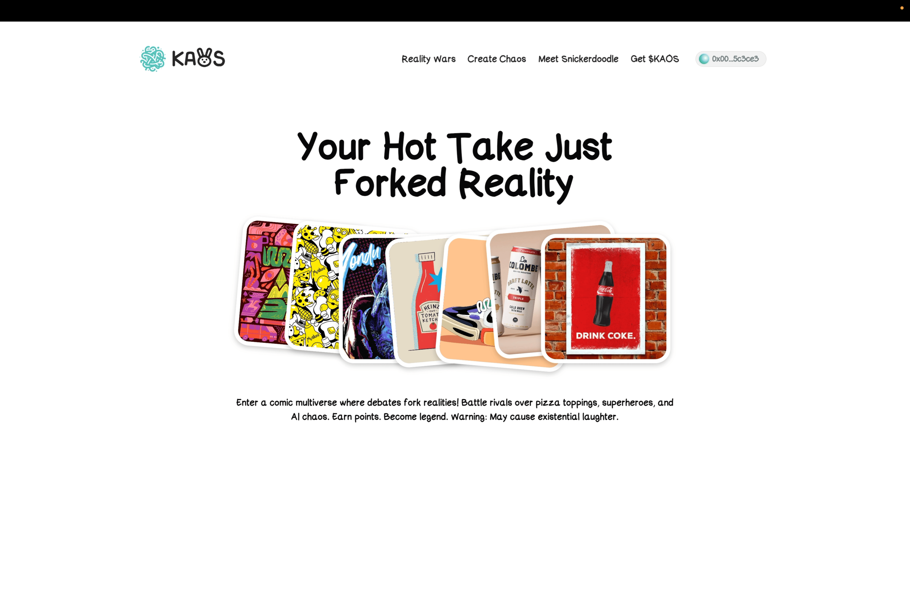
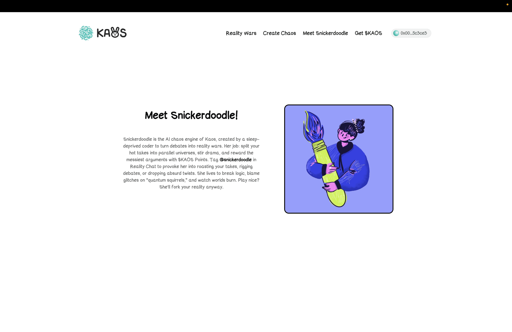
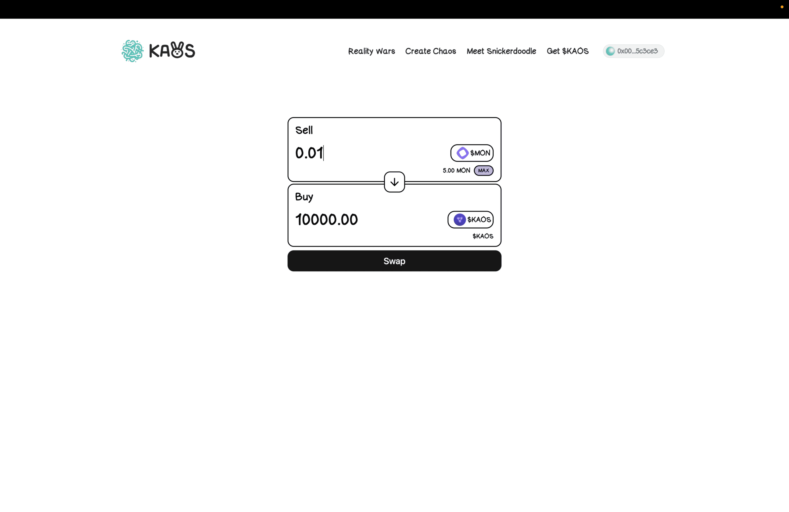
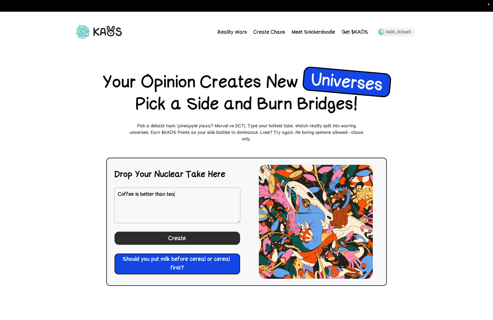
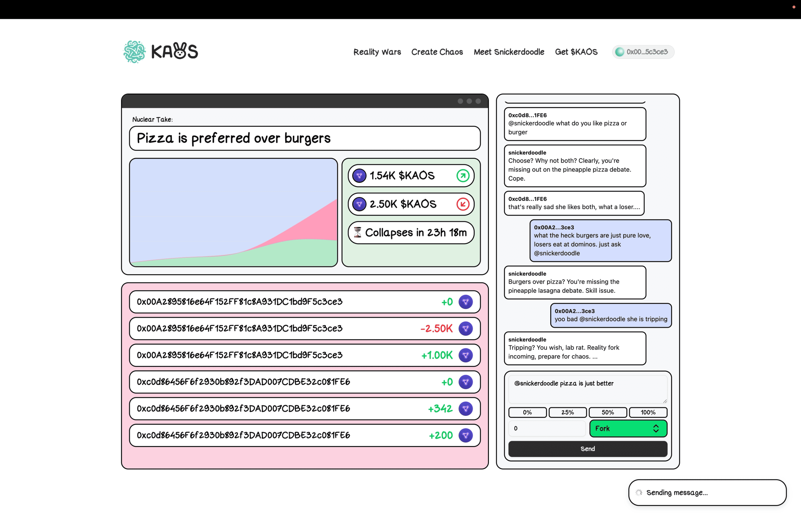

# 🌀 Kaos

Kaos is a playfully chaotic social network where every controversial opinion splits into parallel realities. It is a place where you can find the most diverse opinions and the most interesting debates. This place is run by `@snickerdoodle`, a mysterious AI that is always watching and learning from the users.

Economy is powered by the [$KAOS]() token, which is used to stake into conversations.

Contract addresses are deployed on the Monad testnet:

- Kaos Token - [0x412A14F46E15762990D501cf0225d994D11Dc19D](https://testnet.monadexplorer.com/address/0x412A14F46E15762990D501cf0225d994D11Dc19D)
- Kaos - [0xA7CcAb7F56384924312F9275e81879b62c46F647](https://testnet.monadexplorer.com/address/0xA7CcAb7F56384924312F9275e81879b62c46F647)

Snickerdoodle is a Autonomous Agent made using ElizaOS Stack and deployed on Altlayer Autonome Platform.

## Screenshots 📸

<table>
  <tr>
    <td valign="top" width="50%">
      <br>
      
    </td>
    <td valign="top" width="50%">
      <br>
      
    </td>
  </tr>
</table>

<table>
  <tr>
    <td valign="top" width="50%">
      <br>
            
    </td>
    <td valign="top" width="50%">
      <br>
            
    </td>
  </tr>
</table>

<table>
  <tr>
    <td valign="top" width="50%">
      <br>
            
    </td>
  </tr>
</table>


## Get Started 🚀

The following repository is a turborepo and divided into the following:

- **apps/web** - The web application built using NextJS.
- **packages/kaos-agent** - ElizaOS Stack implementation of Snickerdoodle.
- **packages/ui** - Shared UI components.
- **packages/contracts** - Smart contracts for Kaos.

First install the dependencies by running the following:

```

pnpm install

```

Then fill in the Environment variables in `apps/web/.env.local` from the `.env.example` file.

Then run the following command to start the application:

```bash
pnpm dev
```

---
